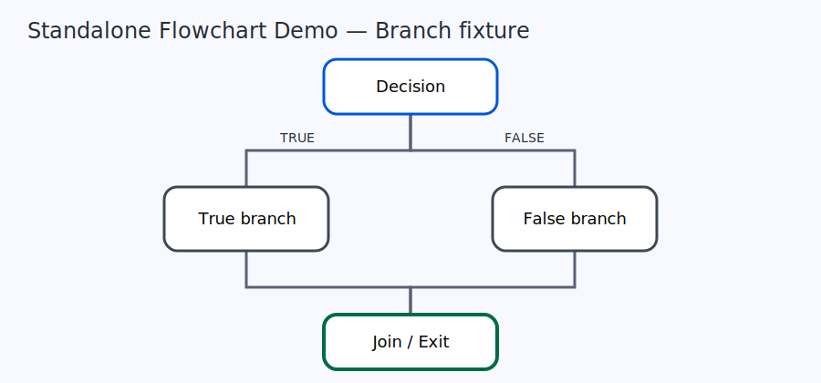
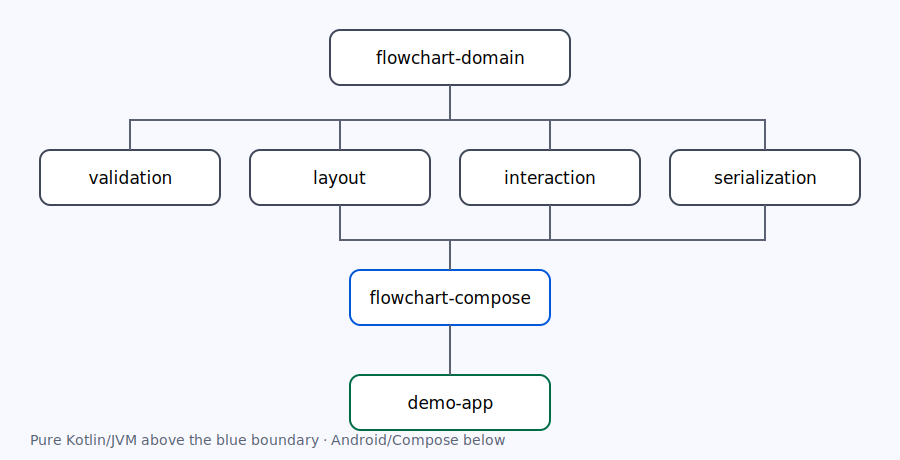

# visualtasker-flowchart

[](LICENSE)
[](https://github.com/robertprit/visualtasker-flowchart/actions/workflows/build.yml)

A producer-neutral, deterministic Flowchart document, layout, interaction, serialization, and Android Compose library.



## Authority rule

The Workflow Domain remains semantic authority. `FlowGraphDocument` is a derived, read-only Perspective supplied by a producer. The library does not parse source, compile, execute, save projects, or mutate workflow semantics. There is intentionally **no reverse compiler**.

## Architecture



```text
flowchart-domain
  ├─ flowchart-validation
  ├─ flowchart-layout
  ├─ flowchart-interaction
  └─ flowchart-serialization
           └──────── flowchart-compose
public modules ───── flowchart-test-support
all public modules ─ demo-app
```

The JVM modules contain no Android dependencies. Android and Compose are isolated in `flowchart-compose` and `demo-app`.

## Quick start

During `0.1.0-SNAPSHOT` development, include this repository as a Gradle composite build or publish it to your own local Maven repository. The future dependency coordinate is:

```kotlin
implementation("de.visualtasker.flowchart:flowchart-compose:0.1.0-SNAPSHOT")
```

```kotlin
val controller = remember { FlowchartController(FlowSurfaceId("main")) }
DisposableEffect(controller) { onDispose(controller::close) }

FlowchartHost(
    graphDocument = producerGraph,
    viewDocument = restoredView,
    runtimeSnapshot = currentRun,
    controller = controller,
    callbacks = FlowchartHostCallbacks(
        onViewDocumentChanged = hostPersistence::saveView,
        onRunRequested = hostRuntime::requestRun,
    ),
)
```

The host owns persistence location and timing. `onRunRequested` is only a request; the library never executes a workflow.

## Documents and guarantees

- `FlowGraphDocument`: immutable semantic read model without positions, runtime state, or authority methods.
- `FlowViewDocument`: discardable positions, viewport, route and annotation state tied to graph identity/revision.
- `FlowInteractionState`: transient selection, hover, drag, marquee, and view undo/redo; not serialized by default.
- `FlowRuntimeSnapshot`: immutable run/session/document/revision/sequence-qualified overlay.
- Layout and orthogonal routing are deterministic for identical graph, metrics, configuration, and seed.
- JSON codecs use explicit schema versions, recursively sorted keys, stable collection ordering, UTF-8, and typed schema rejection.

See [Public API](docs/PUBLIC_API.md), [Architecture](docs/ARCHITECTURE.md), and [Compatibility](docs/COMPATIBILITY.md). Contributions follow [CONTRIBUTING.md](CONTRIBUTING.md).

## Build

```bash
./gradlew check
./gradlew :demo-app:assembleDebug
```

Java 17 and Android SDK 36 are required for Android modules. JVM modules build independently of Android APIs.

Licensed under [Apache License 2.0](LICENSE).
